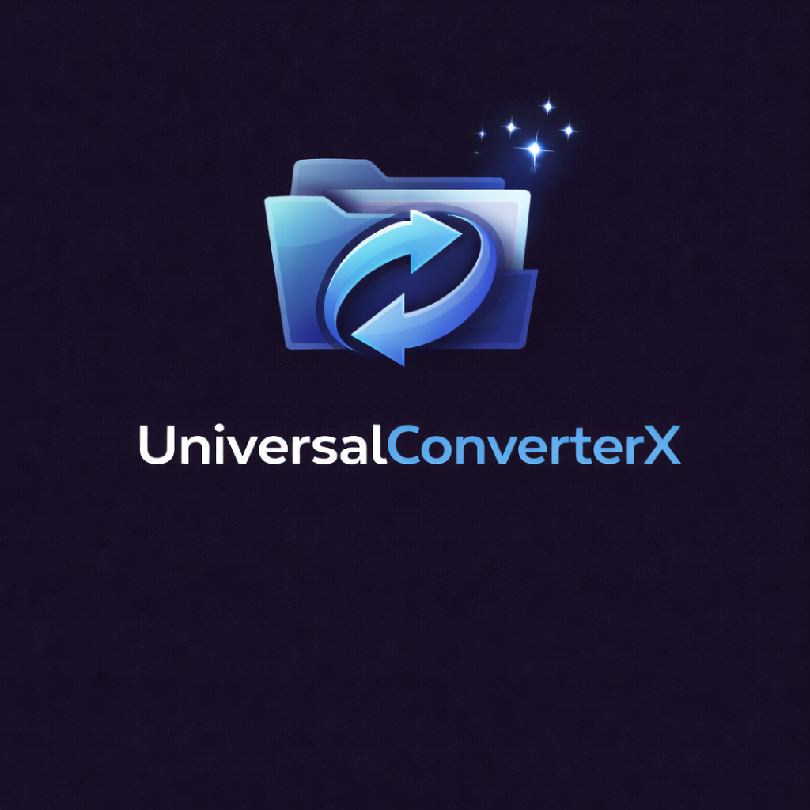

<!-- codex-branding:start -->
<p align="center"></p>

<p align="center">
  
  
  
</p>
<!-- codex-branding:end -->

# UniversalConverter X

A powerful, native Windows file conversion application with context menu integration, supporting 1000+ format conversions.


## Features

- **🖱️ Right-Click Context Menu** - Convert files directly from Windows Explorer
- **📁 1000+ Formats** - Video, audio, images, documents, e-books, 3D models, and more
- **🔒 Local Processing** - All conversions happen on your machine
- **📊 Progress Tracking** - Real-time progress with speed and ETA
- **⚡ Batch Conversion** - Convert multiple files at once
- **🎨 Modern UI** - WinUI 3 with dark theme and Mica effects
- **💻 CLI Support** - Full command-line interface for automation

## Supported Converters

| Converter | Input Formats | Output Formats | Category | Priority |
|-----------|--------------|----------------|----------|----------|
| FFmpeg | 472+ | 199+ | Video, Audio | 100 |
| resvg | 1 (SVG) | 4+ | SVG Rendering | 97 |
| libheif | 4+ | 3+ | HEIC/HEIF | 96 |
| Inkscape | 10+ | 17+ | Vector Graphics | 95 |
| libjxl | 2+ | 3+ | JPEG XL | 94 |
| libvips | 40+ | 25+ | High-Perf Images | 92 |
| ImageMagick | 245+ | 183+ | General Images | 90 |
| Potrace | 5+ | 6+ | Raster to Vector | 88 |
| Calibre | 26+ | 19+ | E-books | 85 |
| Assimp | 40+ | 25+ | 3D Models | 85 |
| Pandoc | 43+ | 65+ | Documents | 80 |
| Ghostscript | 4+ | 8+ | PDF Processing | 75 |
| LibreOffice | 41+ | 22+ | Office Docs | 70 |

## Installation

### Requirements

- Windows 10 21H2+ or Windows 11
- .NET 8 Runtime
- One or more converter tools (FFmpeg, ImageMagick, etc.)

### Quick Start

1. Download the latest release
2. Run the installer
3. Install converter tools (or use `ucx tools download`)
4. Start converting!

## CLI Usage

```bash
# Convert a single file
ucx convert video.mp4 -o mp3

# Convert multiple files
ucx convert *.png -o webp -q high

# List supported formats
ucx list formats

# Check installed tools
ucx tools check

# Show file info
ucx info document.pdf
```

### Commands

| Command | Description |
|---------|-------------|
| `convert` | Convert one or more files |
| `list` | List formats, converters, or categories |
| `info` | Show information about a file |
| `config` | View or modify configuration |
| `tools` | Manage converter tools |

### Convert Options

```
-o, --output <FORMAT>     Output format (required)
-d, --directory <PATH>    Output directory
-q, --quality <LEVEL>     Quality: lowest, low, medium, high, highest, lossless
-f, --force               Overwrite existing files
-p, --parallel <COUNT>    Maximum parallel conversions
--converter <ID>          Force a specific converter
--hw-accel                Enable hardware acceleration
```

## Project Structure

```
UniversalConverterX/
├── src/
│   ├── UniversalConverterX.Core/          # Core conversion engine
│   │   ├── Interfaces/                    # Core interfaces
│   │   ├── Models/                        # Data models
│   │   ├── Converters/                    # 13 strategy implementations
│   │   ├── Services/                      # Orchestrator, ToolManager, ToolDownloader
│   │   ├── Configuration/                 # Options
│   │   └── Detection/                     # Magic bytes format detection
│   ├── UniversalConverterX.Console/       # CLI application
│   │   └── Commands/                      # CLI commands
│   ├── UniversalConverterX.UI/            # WinUI 3 application
│   │   ├── Views/                         # XAML views
│   │   ├── ViewModels/                    # MVVM ViewModels
│   │   └── Services/                      # UI services
│   └── UniversalConverterX.ShellExtension/ # Windows Explorer integration
├── tests/
│   └── UniversalConverterX.Core.Tests/    # Unit tests
├── installer/
│   ├── msix/                              # MSIX package manifest
│   └── wix/                               # WiX MSI installer
└── tools/
    └── bin/                               # CLI tool binaries
```

## Building from Source

### Prerequisites

- .NET 8 SDK
- Windows 10 SDK (for UI project)
- Visual Studio 2022 (recommended)

### Build

```bash
# Restore packages
dotnet restore

# Build all projects
dotnet build

# Build release
dotnet build -c Release

# Run tests
dotnet test
```

### Publish

```bash
# Publish CLI
dotnet publish src/UniversalConverterX.Console -c Release -o publish/cli

# Publish UI (self-contained)
dotnet publish src/UniversalConverterX.UI -c Release -r win-x64 --self-contained -o publish/ui
```

## Architecture

### Strategy Pattern

Each converter tool implements `IConverterStrategy`:

```csharp
public interface IConverterStrategy
{
    string Id { get; }
    string Name { get; }
    int Priority { get; }
    bool CanConvert(FileFormat source, FileFormat target);
    Task<ConversionResult> ConvertAsync(ConversionJob job, ...);
}
```

### Orchestrator

The `ConversionOrchestrator` routes conversions to the best available strategy:

1. Detects input format (magic bytes + extension)
2. Finds converters supporting the conversion
3. Selects highest priority converter
4. Executes conversion with progress tracking

## Configuration

Configuration is stored in `%APPDATA%\UniversalConverterX\config.json`:

```json
{
  "ToolsBasePath": "C:\\Tools\\UniversalConverterX",
  "MaxConcurrentConversions": 4,
  "EnableHardwareAcceleration": true,
  "PreserveMetadata": true,
  "DefaultQuality": "High"
}
```

## Installing Converter Tools

### Windows (winget)

```powershell
winget install Gyan.FFmpeg
winget install ImageMagick.ImageMagick
winget install JohnMacFarlane.Pandoc
winget install calibre.calibre
winget install TheDocumentFoundation.LibreOffice
```

### Windows (Chocolatey)

```powershell
choco install ffmpeg imagemagick pandoc calibre libreoffice
```

## License

MIT License - see LICENSE file for details.

## Contributing

Contributions are welcome! Please read CONTRIBUTING.md for guidelines.

## Acknowledgments

- [FFmpeg](https://ffmpeg.org/) - Video/audio processing
- [ImageMagick](https://imagemagick.org/) - Image processing
- [Pandoc](https://pandoc.org/) - Document conversion
- [Calibre](https://calibre-ebook.com/) - E-book conversion
- [LibreOffice](https://www.libreoffice.org/) - Office documents
- [Inkscape](https://inkscape.org/) - Vector graphics
- [Ghostscript](https://www.ghostscript.com/) - PDF processing
- [libvips](https://www.libvips.org/) - High-performance image processing
- [libheif](https://github.com/strukturag/libheif) - HEIC/HEIF support
- [libjxl](https://github.com/libjxl/libjxl) - JPEG XL support
- [resvg](https://github.com/RazrFalcon/resvg) - SVG rendering
- [Potrace](http://potrace.sourceforge.net/) - Raster to vector tracing
- [Assimp](https://www.assimp.org/) - 3D model import
