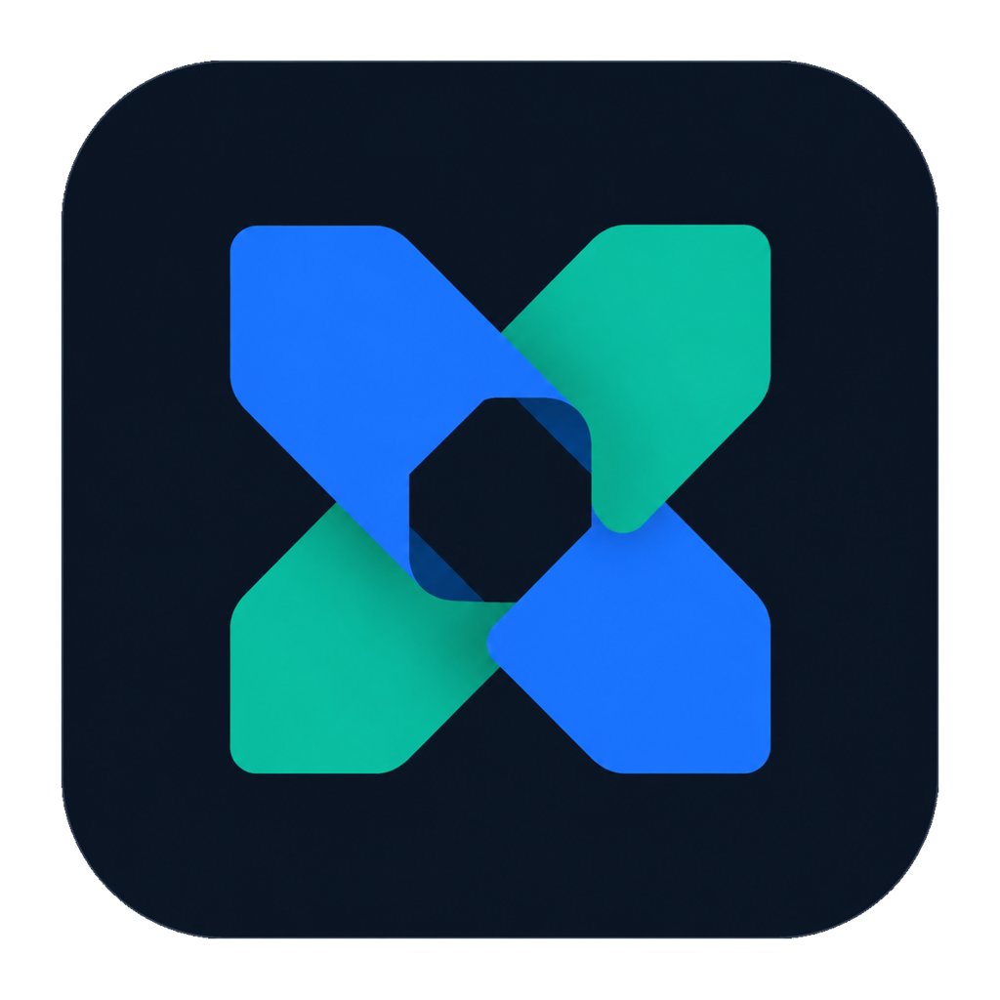

# UniversalConverter X

<p align="center">
  
</p>

The all-in-one media tool for Windows — convert, compress, edit, download, record, and 25+ AI-powered tools, all running locally.

A free, open-source alternative to Wondershare UniConverter and similar paid suites. No subscriptions, no cloud processing, no telemetry.


## Interface

UniversalConverter X uses a compact, queue-first desktop workspace: readable typography, restrained tonal surfaces, short page headers, and primary actions kept high in the viewport. Converter opens by default with a flat selectable file table, split Add files action, functional reorder/remove toolbar, and one unified output inspector for format, quality, resolution, frame rate, audio, and destination controls. Status remains quiet inline metadata instead of decorative badges.

## Modules

- **Converter** — 1000+ formats via FFmpeg, ImageMagick, Pandoc, libvips, libjxl, libheif, Inkscape, Calibre, Assimp, Ghostscript, LibreOffice, resvg, Potrace.
- **Compressor** — web/archive profiles, cap-safe social size targets, custom maximum-size two-pass encoding, VMAF-targeted smart compression with verified quality scores, bounded representative previews with linked VMAF comparison and full-run size/time estimates, and a guarded D3D12 zero-copy path that probes the real driver before use and falls back without losing requested scaling or deinterlacing.
- **APV camera masters** — detect RFC 9924 raw APV and convert locally to H.265 10-bit, ProRes 422 HQ, or H.264 with the bundled FFmpeg build.
- **Preservation and production** — curated FFV1+FLAC archival, ProRes 422, and DNxHR HQ workflows with family filters in the preset browser.
- **Video Editor** — trim, crop, rotate, upscale, filter, audio adjust, batch.
- **Video Enhancer** — portable Real-ESRGAN export, managed RIFE Vulkan frame interpolation, optional Anime4K v4 GLSL chains through mpv, bounded representative previews with synchronized source/output comparison and VMAF estimates, a local Windows App SDK 2.3.1 VideoScaler capability check, and optional SeedVR2 3B FP8 diffusion restoration for CUDA GPUs.
- **UltraHDR gain maps** — preserve ISO 21496-1 metadata during JPEG round-trips, convert UltraHDR JPEG to gain-map AVIF, or create AVIF gain maps from SDR/HDR image pairs through pinned libvips 8.18.3 and libavif 1.4.2 runtimes.
- **Content Credentials** — inspect and validate embedded C2PA provenance offline through optional c2patool 0.27+, with remote manifests, OCSP, trust-list downloads, and signing disabled.
- **IAMF immersive audio** — create stereo or scalable stereo/5.1 IAMF masters, preserve IAMF stream groups in MP4, and render 48 kHz WAV/FLAC through bundled FFmpeg 8.1.2.
- **Offline AI video tags** — sample images or video frames locally, identify 80 COCO object classes, and write bounded per-frame detections plus aggregate tags as atomic JSON.
- **Offline neural speech** — generate two-speaker English dialogue with Dia2 1B or a consented, PerTh-watermarked voice clone with Chatterbox Turbo. Both use pinned local assets with exact hashes and separate CUDA runtimes; inference cannot access the network.
- **Reviewed ComfyUI workflows** — submit an Export (API) graph to an already running loopback ComfyUI server, wait for its exact prompt ID, and atomically export local artifacts without installing nodes or models.
- **Lossless display metadata** — H.264/H.265 edge-crop metadata and packet-preserving aspect-ratio overrides in the Editor and ClipForge presets.
- **Downloader** — 1000+ sites: YouTube, Twitch, Kick, Rumble, Vimeo, X, Facebook, podcasts, direct URLs; direct dynamic DASH streams support bounded recording with segment-window limits and reconnect recovery.
- **Recorder** — screen, webcam, system audio, microphone.
- **Automation** — shared CLI/REST/PowerShell engine catalog plus safe metadata-based conditional preset planning.
- **Toolbox** — 40+ specialized tools across Image, Video, AI, Audio, Documents, Disc, and Other categories.
- **Large-list performance** — Toolbox tiles, preset cards, and History rows use virtualized containers; History pages its retained rows on demand and preset filtering is debounced for responsive catalog browsing.
- **Representative video previews** — Compressor and Video Enhancer can render a bounded sample with the exact full-job settings, compare source/output side by side in VMAF, estimate full-run size/time, and promote those settings back into the queue.

## Toolbox highlights

| Category | Tools |
|---|---|
| **Image** | Image Converter · GIF Maker · Image Upscaler (AI) · AI Portrait · Slideshow Maker · Metadata Editor |
| **Video** | Offline AI Tags · Auto Highlight · Av1an Per-Scene Parallel Encode · Trusted VapourSynth Scripts · Auto Reframe (AI) · Auto Crop (AI) · Watermark Editor · Frame Snapshot · Scene Detection · Timeline Preview · Track Manager |
| **AI** | Reviewed ComfyUI Workflows · Background Remover · Subtitle Remover · Auto Subtitle · Vocal Remover · Voice Changer · Text-to-Speech · Speech-to-Text · Photo Restoration · Lip Reading |
| **Audio** | Audio Converter · Audio Compressor · IAMF Immersive Audio · Spatial Audio (Ambisonics / binaural / 5.1 / 7.1) · Noise Remover (AI) |
| **Documents** | Document Converter (LibreOffice) · Archive Tool (7-Zip) · PDF Tools (pikepdf) · Subtitle Converter (pysubs2) · Font Converter (fonttools) · eBook Converter (Calibre + EPUB↔KEPUB) · Comic device profiles (CBZ/CBR -> EPUB/MOBI) · Unified image + searchable PDF/A OCR |
| **Disc** | Data CD/DVD/Blu-ray imaging and burn · DVD-Video authoring · single-title BDMV authoring · DVD Rip · Commercial Detection · DVD Copy (planned) |
| **Other** | Format Inspector · Content Credentials · Pkl Preset Compiler · Chapter Marks · Watch Folders · History · VMAF Quality |

## Architecture

UCX is a C# / .NET 10 / WinUI 3 shell that hosts the Converter natively and orchestrates specialized engines as sidecar processes. Each sidecar lives under `tools/<name>/` and follows the NDJSON CLI contract documented in [`tools/README.md`](tools/README.md). Its `ucx.sidecar.json` declares the v2 schema, engine version, host-version range, capabilities, supported architecture, tool/model requirements, and migration path. UCX validates that contract during discovery, health checks, CLI/REST diagnostics, and immediately before launch; an old, unsupported, or architecture-mismatched extension is quarantined with a rebuild or reinstall reason.

Representative sidecar engines: VideoCrush, ClipForge, StreamKeep, AlphaCut, VideoSubtitleRemover, LipSight, Vertigo, FrameSnap, GifStudio, HEICShift, Comskip, Audio Compressor, Voice Changer, Slideshow Maker, and Video Face Enhance.

Local automation definitions can also be compiled from Pkl 0.32+ into UCX preset
XML through the `pkl-preset` engine. The compiler uses `pkl eval` only, confines
file-module access to the source directory, permits only Pkl's built-in output-format property while denying file/environment/network resources and projects,
disables caches and user settings, and emits a preset only after strict schema
validation. Pkl remains an optional external tool and is never downloaded by UCX.

## Features

- Right-Click Context Menu — convert files directly from Windows Explorer.
- Local Processing — all conversions happen on your machine. No telemetry.
- Progress Tracking — real-time progress with speed and ETA, NDJSON sidecar contract.
- Batch Conversion — convert and process multiple files at once.
- Commercial Detection — analyze local recordings through an explicitly provisioned Comskip runtime, emit EDL and chapter metadata without changing the source, and optionally export an atomic commercial-free copy through managed FFmpeg.
- Blu-ray Authoring — transcode one local title to H.264/AC-3, author and validate a persistent BDMV folder, then create a UDF 2.50 ISO or burn it through Windows IMAPI2. The optional tsMuxeR 2.7.0 runtime is installed only by the explicit `tools/discburn/build-runtime.ps1 -AcceptApacheLicense` command from a size- and SHA-256-pinned Apache-2.0 release archive.
- Custom Presets — create, duplicate, and edit validated workflows in-app, including per-file, input-only batch, output-folder batch, single-output, and extraction modes.
- Reviewed Community Presets — inspect the bundled SysAdminDoc-operated catalog offline, preview the exact engine/arguments/license/SHA-256, and install only after explicit digest acceptance; installed entries never auto-update.
- Semantic Preset Search — rank natural media intents such as “make movie smaller” with local sparse TF-IDF vectors and domain aliases in both the Presets UI and CLI; no model, Qdrant service, network, or telemetry is involved.
- Offline Neural Speech — run Dia2 1B multi-speaker dialogue or Chatterbox Turbo voice cloning from the Presets UI and automation surfaces. Chatterbox requires selecting exactly one local reference-audio file together with one or more text files, and the preset explicitly acknowledges consent; generated audio retains the model's PerTh watermark.
- Reviewed ComfyUI Workflows — run local Export (API) JSON through a separately managed loopback ComfyUI server, with explicit trust, bounded overrides/polling/exports, blocked redirects and known network nodes, and atomic output directories.
- Av1an Per-Scene Encoding — split long videos at detected scene boundaries, distribute chunks across local encoder processes, resume interrupted work, and optionally target a perceptual quality score through a user-installed Av1an/VapourSynth/encoder toolchain.
- Trusted VapourSynth Scripts — inspect output metadata, export simple/full DOT filter graphs, or render a reviewed local `.vpy` script through VSPipe and managed FFmpeg. Scripts are executable Python and require explicit trust; UCX never downloads them.
- Image Quality Targeting — automatically find the best JPEG, WebP, AVIF, HEIC, or JXL quality for a size, PSNR, or local SSIMULACRA2 target.
- Batch Image Editing — apply named looks, colour/tone controls, blur, grain, vignette, tint, and borders while retaining compatible alpha and multi-frame output.
- Face Blur Privacy Filter — detect and irreversibly obscure frontal faces in every video frame with an offline, fail-closed OpenCV pipeline.
- Offline AI Video Tags — sample up to a bounded number of local frames, detect people/animals/vehicles and other COCO objects, and produce searchable JSON metadata without changing the source media.
- Auto Highlight — rank scene-change and visible-motion peaks locally, review clip windows, and export an audio-preserving reel, CMX 3600 EDL, or OpenTimelineIO timeline.
- Exact Chapter Editor — import, edit, delete, and export MKV/MP4/MOV markers while retaining untouched PTS values; verified stream-copy muxing uses MKVToolNix 97+ for MKV and FFmpeg for MP4/MOV.
- Conversion History — use bounded multi-term local search across engines, actions, source/output paths, presets, and failure details; export filtered jobs or restore exact Converter settings for a re-run.
- Queue Automation — notify, sleep, safely schedule shutdown, or run a hidden PowerShell hook with a JSON summary.
- Watch Folders — process stable new or renamed files automatically with duplicate and self-output loop protection.
- Modern UI — compact WinUI 3 shell with readable typography, tonal grouping, consistent page hierarchy, and dark/light themes.
- CLI Support — full command-line interface for automation (`ucx`).

## Supported Converters

| Converter | Input Formats | Output Formats | Category | Priority |
|-----------|--------------|----------------|----------|----------|
| FFmpeg | 472+ | 199+ | Video, Audio | 100 |
| resvg | 1 (SVG) | 4+ | SVG Rendering | 97 |
| libheif | 4+ | 3+ | HEIC/HEIF | 96 |
| Inkscape | 10+ | 17+ | Vector Graphics | 95 |
| libjxl | 2+ | 3+ | JPEG XL | 94 |
| libvips | 40+ | 25+ | High-Perf Images | 92 |
| ImageMagick | 245+ | 183+ | General Images | 90 |
| Potrace | 5+ | 6+ | Raster to Vector | 88 |
| Calibre | 26+ | 19+ | E-books | 85 |
| Assimp | 40+ | 25+ | 3D Models | 85 |
| Pandoc | 43+ | 65+ | Documents | 80 |
| Ghostscript | 4+ | 8+ | PDF Processing | 75 |
| LibreOffice | 41+ | 22+ | Office Docs | 70 |

## Installation

### Requirements

- Windows 10 21H2 (build 19044)+ or Windows 11
- Published UI and CLI artifacts are self-contained; the installer also stages framework-dependent shell/proxy hosts, so those hosts need a compatible .NET 10 runtime. Source builds require the .NET 10 SDK, and the installer build checks for .NET 10.0.10 or newer
- Additional converter tools as needed (the Windows installer includes FFmpeg 8.1.2)
- eBook/comic sidecars install their pinned Python dependencies during the sidecar build; comic MOBI output additionally needs Calibre, and UCX refuses protected Kindle/KFX inputs because it does not include DeDRM
- DVD-Video authoring requires `dvdauthor` on `PATH` or configured through `UCX_DVDAUTHOR`; data CD/DVD imaging and burning use Windows IMAPI2 without it
- Gain-map presets require the opt-in pinned runtime (`gainmap download-runtime --accept-licenses`); the manifest records third-party licenses, immutable URLs, sizes, and SHA-256 hashes
- Dia2 and Chatterbox are opt-in GPU tools. Install their reviewed model bundles with `ucx invoke-engine dia2tts --args-json '["install-model","--accept-license"]'` and `ucx invoke-engine chatterboxtts --args-json '["install-model","--accept-license"]'`. Dia2 uses Apache-2.0 code/weights plus the CC-BY-4.0 Mimi codec weights; Chatterbox and its PerTh watermarker are MIT.

### Quick Start

1. Install the portable release with `winget install SysAdminDoc.UniversalConverterX`, or download and extract the unsigned portable ZIP from the latest release.
2. Launch `UniversalConverterX.exe` for the desktop workspace or `ucx.exe` for automation.
3. Install any additional converter tools you need (or use `ucx tools download`).
4. Start converting!

Explorer and file-association launches send every selected path to a single
running Converter window. Packaged builds also register `ucx:` routes such as
`ucx:converter` and `ucx:history`; completion notifications reopen History.

The release also includes intentionally unsigned MSI and MSIX packages for managed environments that apply their own signing or disposable local sideload key. The portable ZIP needs no certificate and is the artifact used by WinGet; no artifact is presented as signed unless a downstream release process signs it.

### Supported platform and release matrix

The supported desktop floor is Windows 10 21H2 (build 19044) or Windows 11.
The project publishes both x64 and ARM64 app binaries, but the current frozen
sidecar catalog is x64-only unless a manifest explicitly advertises another
architecture. UCX reports those availability limits instead of claiming that
an ARM64 app has native ARM64 sidecars.

| Surface | OS / architecture | Runtime and package behavior | Sidecars and migration | Signing / install behavior |
|---|---|---|---|---|
| Source build and tests | Windows 10 21H2+ or Windows 11; x64 test host, ARM64 publish supported | .NET 10 SDK, Python 3.12, Windows SDK; no release package | Source manifests cover 212 engines; v2 compatibility validation runs before launch | Developer build; no signing implied |
| Portable ZIP / WinGet | Windows 10 21H2+ or Windows 11; `win-x64` | Self-contained .NET 10 UI/CLI; framework-dependent shell/proxy hosts use the installed .NET 10 runtime | Readiness manifest reports bundled, on-demand, or unavailable engines; old v1 extension manifests are quarantined and require reinstall | Unsigned archive; WinGet consumes the portable archive and needs no certificate |
| MSIX | Windows 10 21H2+ or Windows 11; `x64` | Self-contained WinUI 3 / Windows App SDK 2.3.1 UI; shell/proxy hosts follow their publish settings | Same v2 manifest and readiness rules; current bundled sidecars are x64 | Intentionally unsigned source artifact; managed sideloading supplies the signing policy/key |
| MSI | Windows 10 21H2+ or Windows 11; `x64` | Self-contained WinUI 3 / CLI; shell/proxy hosts use the installed .NET 10 runtime | Same v2 manifest and readiness rules; current bundled sidecars are x64 | Unsigned build output; downstream distribution must sign it if required |
| ARM64 publish | Windows 10 21H2+ or Windows 11; `win-arm64` | Self-contained app and shell binaries; no ARM64 package claim | Current sidecar manifests advertise `win-x64`, so native ARM64 sidecar availability is not claimed | Unpackaged developer/release output; signing is external |

Every extension is checked against schema, host version, architecture,
capabilities, and migration metadata during discovery and immediately before
execution. A failure is actionable and keeps the extension quarantined.

## CLI Usage

```bash
# Convert a single file
ucx convert video.mp4 -o mp3

# Convert multiple files
ucx convert *.png -o webp -q high

# Export per-file status, sizes, timing, and warnings as JSON or CSV
ucx convert *.mov -o mp4 --report batch-report.json

# Move originals to an archive folder after verified output is created
ucx convert *.mov -o mp4 --source-action move --source-archive _converted-sources

# List supported formats
ucx list formats

# Check installed tools
ucx tools check

# Show file info
ucx info document.pdf

# Discover the same native and sidecar engines exposed by the desktop, REST,
# and PowerShell surfaces; include readiness and manifest metadata as JSON
ucx engines --json

# Invoke any installed sidecar without a preset-specific CLI wrapper
ucx invoke-engine scenedetect --args-json '["presets"]'

# Run the preset-backed offline video tagger after its explicit model install
ucx convert-preset --preset "AI Video Tags - Offline JSON" video.mp4

# Rank up to 50 presets by local semantic similarity
ucx convert-preset --list --search "make movie smaller"

# Inspect and explicitly install a reviewed local community preset
ucx community-presets list
ucx community-presets preview community-h264-720p-compact
ucx community-presets install community-h264-720p-compact --accept-sha256 <digest>

# Start the loopback-only REST surface; it prints a fresh bearer token.
# GET /engines and POST /convert require Authorization: Bearer <token>.
ucx serve --port 17654

# Scrape dependency-free local job counters and gauges in Prometheus 0.0.4 format
curl -H "Authorization: Bearer <token>" http://127.0.0.1:17654/metrics
```

### Commands

| Command | Description |
|---------|-------------|
| `convert` | Convert one or more files |
| `list` | List formats, converters, or categories |
| `info` | Show information about a file |
| `config` | View or modify configuration |
| `tools` | Manage converter tools |
| `engines` | Discover the shared UI/CLI/REST/PowerShell engine catalogue |
| `invoke-engine` | Run an installed sidecar with a JSON argument array |
| `convert-preset` | Run a named desktop-compatible preset |
| `community-presets` | List, preview, and explicitly install the reviewed offline catalog |
| `serve` | Host the loopback-only REST job API |

`serve` also exposes loopback-only Prometheus metrics at `/metrics`. A local
scrape configuration and importable Grafana dashboard live under
[`integrations/prometheus/`](integrations/prometheus/README.md); UCX itself does
not install or contact either service.

### Convert Options

```
-o, --output <FORMAT>     Output format (required)
-d, --directory <PATH>    Output directory
-q, --quality <LEVEL>     Quality: lowest, low, medium, high, highest, lossless
-f, --force               Overwrite existing files
-p, --parallel <COUNT>    Maximum parallel conversions
--converter <ID>          Force a specific converter
--hw-accel                Enable hardware acceleration
--source-action <ACTION>  After success: keep, move, or delete the source
--source-archive <PATH>   Archive folder for --source-action move
--report <PATH>           Write a per-file .json or .csv batch report
```

The History page can also export the current filtered history view as the same JSON or CSV report schema.

The bundled PowerShell module exposes the same catalogue through `Get-UcxEngine`
and the same raw invocation path through `Invoke-UcxEngine`. The native
`converter` engine maps to `ucx convert`; every specialized engine maps to the
same frozen executable selected by WinUI and REST.

## Project planning

- [ROADMAP.md](ROADMAP.md) — active roadmap (actionable open work only).
- [CHANGELOG.md](CHANGELOG.md) — shipped work per release.
- [docs/research/](docs/research/) — audit and research evidence.

## Project Structure

```
UniversalConverterX/
├── src/
│   ├── UniversalConverterX.Core/          # Core conversion engine
│   │   ├── Interfaces/                    # Core interfaces
│   │   ├── Models/                        # Data models
│   │   ├── Converters/                    # 13 strategy implementations
│   │   ├── Services/                      # Orchestrator, ToolManager, ToolDownloader
│   │   ├── Configuration/                 # Options
│   │   └── Detection/                     # Magic bytes format detection
│   ├── UniversalConverterX.Console/       # CLI application
│   │   └── Commands/                      # CLI commands
│   ├── UniversalConverterX.UI/            # WinUI 3 application
│   │   ├── Views/                         # XAML views
│   │   ├── ViewModels/                    # MVVM ViewModels
│   │   └── Services/                      # UI services
│   └── UniversalConverterX.ShellExtension/ # Windows Explorer integration
├── tests/
│   └── UniversalConverterX.Core.Tests/    # Unit tests
├── installer/
│   ├── msix/                              # MSIX package manifest
│   └── wix/                               # WiX MSI installer
└── tools/
    └── bin/                               # CLI tool binaries
```

## Building from Source

### Prerequisites

- .NET 10 SDK
- Python 3.12 (the sidecar, packaging, and dependency gates)
- Windows 10 21H2 (build 19044) or newer for the WinUI project; Windows SDK and WinUI build tools restore from NuGet

### Build

```bash
# Build the full Windows solution
.\build.ps1 -Target Build -Configuration Release

# SDK-native builds can also use dotnet directly
dotnet build src/UniversalConverterX.sln -c Release -p:Platform=x64
dotnet build src/UniversalConverterX.Console/UniversalConverterX.Console.csproj -c Release
```

NuGet restore is locked: `packages.lock.json` is committed per project and the
release gate restores with `--locked-mode`, so a transitive version change has
to be an explicit, reviewed lock-file update.

### Test

`-Target Test` is the whole release contract in one fail-fast command. It runs
20 gates — NuGet lock, build, Core suite, VideoScaler probe, Python syntax
sweep, documentation/platform consistency, 212-sidecar contract, sidecar and shared-library unit tests,
localization parity, static UIA coverage, release-manifest tests, sidecar
dependency manifests, NuGet vulnerability and deprecation audits, allowlist
expiry, the runtime UI sweep, staged-artifact verification, and SBOM
reconciliation — and writes `artifacts/gates/gate-summary.json`. Gates needing
artifacts you have not built (a staged publish tree) report as skipped with the
reason rather than being silently dropped.

```bash
# Everything
.\build.ps1 -Target Test -Configuration Release

# One gate while iterating (ids are in the summary)
.\tools\gates\Invoke-Gates.ps1 -Only core-tests

# Report every failure instead of stopping at the first
.\tools\gates\Invoke-Gates.ps1 -ContinueOnFailure
```

The runtime UI gate launches the real app and sweeps every registered route in
light, dark, and a narrow reflow pass, capturing a screenshot for any page that
throws, lays out empty, or exposes no reachable focus target. Pass
`-UiSmokeLauncher <script>` to open that window somewhere other than your
desktop.

Vulnerability and deprecation findings can be suppressed only through
`tools/gates/allowlist.json`, where every entry needs a reason, an owner, and an
expiry date; the gate fails on a lapsed entry, so a suppression cannot become
permanent by neglect.

```bash
# Verify representative sidecar manifests, imports, and help/operation surfaces
.\tools\verify-sidecars.ps1 -Mode Fast

# Verify every sidecar; add -Freeze to run each PyInstaller build and frozen --help
.\tools\verify-sidecars.ps1 -Mode All
```

### Publish

```bash
# Publish CLI and WinUI output
.\build.ps1 -Target Publish -Configuration Release

# Cross-publish native ARM64 apphosts and generate the architecture audit
.\build.ps1 -Target Publish -Configuration Release -Architecture arm64
```

The ARM64 publish writes to `publish/win-arm64/` and verifies the PE machine
type of the CLI, WinUI app, Explorer shell extension COM host, and FFmpeg
command proxy. Its generated `compatibility/arm64-publish.json` inventories
installed sidecar executables without inferring architecture from filenames;
x64-only sidecars require Windows x64 emulation or a later ARM64 rebuild.

On a Snapdragon device with an ARM64 Python environment, probe the locally
installed ONNX Runtime package without downloading anything:

```powershell
ucx tools qnn --json
```

The command exits successfully only when the OS and Python runtime are ARM64
and ONNX Runtime exposes `QNNExecutionProvider`. Provider discovery is a
readiness check, not a substitute for the on-device inference acceptance test.

## Architecture

### Strategy Pattern

Each converter tool implements `IConverterStrategy`:

```csharp
public interface IConverterStrategy
{
    string Id { get; }
    string Name { get; }
    int Priority { get; }
    bool CanConvert(FileFormat source, FileFormat target);
    Task<ConversionResult> ConvertAsync(ConversionJob job, ...);
}
```

### Orchestrator

The `ConversionOrchestrator` routes conversions to the best available strategy:

1. Detects input format (magic bytes + extension)
2. Finds converters supporting the conversion
3. Selects highest priority converter
4. Executes conversion with progress tracking

## Configuration

Configuration is stored in `%APPDATA%\UniversalConverterX\config.json`:

```json
{
  "ToolsBasePath": "C:\\Tools\\UniversalConverterX",
  "MaxConcurrentConversions": 4,
  "EnableHardwareAcceleration": true,
  "PreserveMetadata": true,
  "DefaultQuality": "High"
}
```

## Installing Converter Tools

The Windows installer carries a pinned FFmpeg 8.1.2 build. Use **Settings > Converter Tools** or `ucx tools download <tool>` for supported portable tools and updates. UCX installs only SHA-256 verified downloads and keeps replaced binaries under `tools/rollback/<tool>/`.

### Reproducible sidecar builds

Sidecar release builds use one connected preparation step followed by an
offline build:

```powershell
# Resolve and download the selected environments, then build with indexes off.
pwsh tools/build-all.ps1 -Tools hashkit,bgremove -Clean -PrepareDependencies

# Rebuild later from the same verified lock and wheelhouse without a network.
pwsh tools/build-all.ps1 -Tools hashkit,bgremove -Clean
```

Preparation writes `artifacts/python-dependencies/sidecar-lock.json` and its
wheelhouse. The lock records each distribution's authenticated URL, exact size,
and SHA-256; every build recreates its venv, rejects requirement drift and
missing, changed, or additional wheels, installs with hashes and indexes
disabled, and refuses Torch versions older than 2.6.0. Copy or archive that
whole directory when transferring a release build to an offline machine.
`installer/build-installer.ps1` also writes and bundles a CycloneDX 1.7 SBOM for
the exact staged tree, reconciled with NuGet assets, locked Python packages,
native runtimes, sidecars, and optional model manifests.

AI inference never downloads models, packages, repositories, or executables. Supported optional packs expose a separate download action that shows the third-party licence, requires explicit consent, pins an immutable HTTPS source, and verifies both exact size and SHA-256 before atomic installation. Other engines require a pre-provisioned local model and fail closed when it is absent. User-requested online services such as cloud lip reading and local Ollama endpoints remain clearly separate from asset acquisition.

The `bgremove` engine installs BiRefNet and RMBG packs only through its explicit
`download-model` action. For example,
`ucx invoke-engine bgremove --args-json '["download-model","--backend","birefnet","--accept-license"]'`
downloads an allowlisted file set from one full commit revision, verifies every
file's size and cryptographic digest, and atomically records the pack's
provenance. Inference re-verifies that pack, rejects additional or modified code,
uses a private module cache, and keeps Hugging Face offline. BiRefNet is MIT;
RMBG packs retain their BRIA model licences and may have access or commercial-use
restrictions.

The `videotag` engine uses Google's versioned MediaPipe EfficientDet-Lite0 int8
model through standalone LiteRT, not MediaPipe Tasks. Install the 4,602,795-byte
Apache-2.0 model only with `videotag download-model --accept-license`; the exact
SHA-256 is checked before atomic promotion. Tagging then enables the shared
process network guard, samples locally, emits an atomic JSON report, and sends
no usage or performance metrics.

The `comfyui` engine never installs or updates ComfyUI, models, or custom nodes.
Export a graph with ComfyUI's **Export (API)** action, review every node, start
the local server with `--disable-api-nodes`, and run the **ComfyUI - Run Reviewed
Local Workflow** preset. UCX accepts only HTTP loopback endpoints, refuses
redirects, embedded URLs/credentials, and known network/cloud node classes,
requires an explicit workflow acknowledgment, and atomically exports the exact
prompt's final artifacts. Custom nodes remain executable third-party Python and
must be independently trusted.

Converter exposes generated FFmpeg argument templates in its Advanced panel. Command editing is off by default; enable it under **Settings > Advanced** to edit a batch-safe `{input}`/`{output}` template or review exact commands generated inside sidecars before they run. UCX never sends edited text through a command shell and blocks shell metacharacters introduced by an edit.

### Third-party sidecar plugins

Drop each plugin into `%LOCALAPPDATA%\UniversalConverterX\plugins\<id>\`. A plugin remains quarantined until its complete directory hash is approved under **Settings > Trusted Plugins**; changed files are disabled automatically, and links/reparse points are rejected. Trusted presets appear in Presets and as one Toolbox tile per plugin.

Each directory needs a `manifest.json`, its declared executable, and at least one preset:

```json
{
  "schemaVersion": 2,
  "engineVersion": "1.0.0",
  "minHostVersion": "2.36.0",
  "maxHostVersion": null,
  "capabilities": ["ndjson", "presets"],
  "architectures": ["win-x64"],
  "migration": {
    "strategy": "reinstall",
    "fromSchemaVersions": [1],
    "notes": "Reinstall when the manifest schema changes."
  },
  "id": "example-plugin",
  "name": "Example Plugin",
  "version": "1.0.0",
  "description": "Local example conversion workflow",
  "engine": "example-plugin",
  "executable": "example-plugin.exe",
  "presets": ["presets/example.preset.xml"],
  "models": false,
  "tools": []
}
```

The directory name, `id`, and `engine` must match. Plugin preset files use the same validated `.preset.xml` schema as built-in workflows. Trusted status does not bypass compatibility validation: a schema, host-version, capability, or architecture mismatch keeps the plugin quarantined until it is rebuilt or reinstalled.

Subtitle Studio runs a local Whisper → optional Helsinki OPUS-MT ONNX pipeline, opens the timecoded cues for text/timing edits, and exports SRT, VTT, or ASS. Video sources can also receive a hard-coded caption copy after the edited subtitle file is saved.

Speech-to-Text also offers NVIDIA Parakeet TDT 0.6B v3 for CUDA systems and its 25 supported European languages. Its pinned CC-BY-4.0 model pack is never fetched implicitly: select Parakeet, review the license, and use the explicit model-download action before transcribing. CPU-only systems can continue using faster-whisper or whisper.cpp. Faster-whisper also has an off-by-default speaker-label option backed by a revision- and SHA-256-verified pyannote 3.1 local pack; model terms and an explicit download are required, and diarization performs no network or telemetry work during transcription.

Colorize keeps the portable BSD-2-Clause OpenCV CPU tier as its default and adds an optional Apache-2.0 DDColor ONNX temporal tier. The DDColor pack is revision/SHA-256 pinned and explicitly downloaded; video mode uses optical-flow chroma propagation with scene-cut resets to reduce frame flicker, and `UCX_DISABLE_DDCOLOR=1` disables the tier without affecting the fallback.

Video Enhancer keeps Real-ESRGAN as its portable default, adds managed RIFE ncnn-vulkan interpolation to fixed target FPS values, and offers Anime4K v4.0.1 as an optional 2× GLSL backend through mpv. RIFE uses the pinned `rife-v4.6` model path, reports Vulkan readiness before launch, and promotes only a source-preserving, frame-rate-validated artifact; the durable queue supports restart recovery, cancellation, and retry. Modes A, B, and C cover line restoration, soft restoration, and denoise; the pinned approximately 0.8 MB MIT shader pack requires explicit consent and SHA-256 verification, and all rendering remains local. SeedVR2 3B FP8 remains available as an optional diffusion-restoration engine on NVIDIA CUDA systems with at least 10 GB VRAM (12 GB or more recommended). Select SeedVR2, review the Apache-2.0 terms, and explicitly download the pinned approximately 3.9 GB runtime/model pack. UCX verifies immutable revisions and SHA-256 hashes, blocks cleanly when optional packs or runtimes are unavailable, and disables downloads during restoration.

### ONNX Runtime compatibility

ONNX Runtime 1.27 deprecates CUDA 12 and makes CUDA package selection explicit. UCX therefore advances its CPU-only RapidOCR path while holding CUDA-capable engines on the last validated pre-transition line:

| Sidecar | ORT requirement | Execution path | Migration state |
| --- | --- | --- | --- |
| `videosubtitleremover` | `>=1.27,<1.28` | RapidOCR CPU; CUDA work uses PyTorch/Paddle | 1.27 enabled |
| `alphacut` | `>=1.26,<1.27` | Optional ONNX CUDA 12 | Hold for CUDA 13 smoke |
| `stemkit` | `>=1.26,<1.27` | MDX-Net via optional ONNX CUDA 12 | Hold for CUDA 13 smoke |
| `translatekit` | `>=1.26,<1.27` | OPUS-MT via optional ONNX CUDA 12 | Hold for CUDA 13 smoke |

Preset health reports the held CUDA transition before launch. Do not override those upper bounds unless the matching CUDA 13 ONNX Runtime package and the complete sidecar stack have been validated together.

For full YouTube format extraction, install both the managed yt-dlp channel and Deno runtime. The Downloader health card reports their current status and can install or update both:

```powershell
ucx tools download yt-dlp
ucx tools download deno
```

### Windows (winget)

```powershell
winget install Gyan.FFmpeg
winget install ImageMagick.ImageMagick
winget install JohnMacFarlane.Pandoc
winget install calibre.calibre
winget install TheDocumentFoundation.LibreOffice
```

### Windows (Chocolatey)

```powershell
choco install ffmpeg imagemagick pandoc calibre libreoffice
```

## License

MIT License - see LICENSE file for details.

## Contributing

Contributions are welcome. Keep changes focused, add or update headless tests
for behavior changes, and run the relevant release gates before opening a pull
request. The repository intentionally keeps contribution guidance in this
README so a missing local guide cannot make the project instructions stale.

## Acknowledgments

- [FFmpeg](https://ffmpeg.org/) - Video/audio processing
- [ImageMagick](https://imagemagick.org/) - Image processing
- [Pandoc](https://pandoc.org/) - Document conversion
- [Calibre](https://calibre-ebook.com/) - E-book conversion
- [LibreOffice](https://www.libreoffice.org/) - Office documents
- [Inkscape](https://inkscape.org/) - Vector graphics
- [Ghostscript](https://www.ghostscript.com/) - PDF processing
- [yt-dlp](https://github.com/yt-dlp/yt-dlp) - Media extraction and download support
- [Deno](https://deno.com/) - Sandboxed JavaScript runtime for YouTube extraction
- [libvips](https://www.libvips.org/) - High-performance image processing
- [libheif](https://github.com/strukturag/libheif) - HEIC/HEIF support
- [libjxl](https://github.com/libjxl/libjxl) - JPEG XL support
- [resvg](https://github.com/RazrFalcon/resvg) - SVG rendering
- [Potrace](http://potrace.sourceforge.net/) - Raster to vector tracing
- [Assimp](https://www.assimp.org/) - 3D model import
