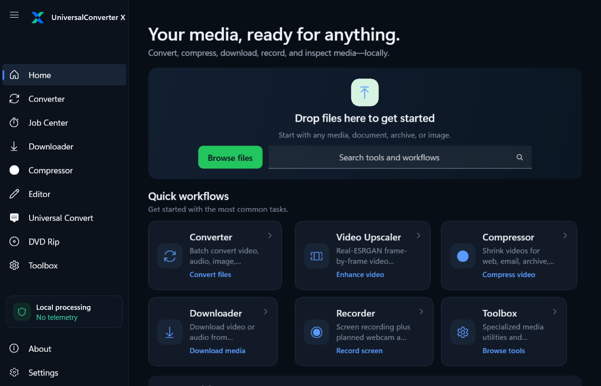
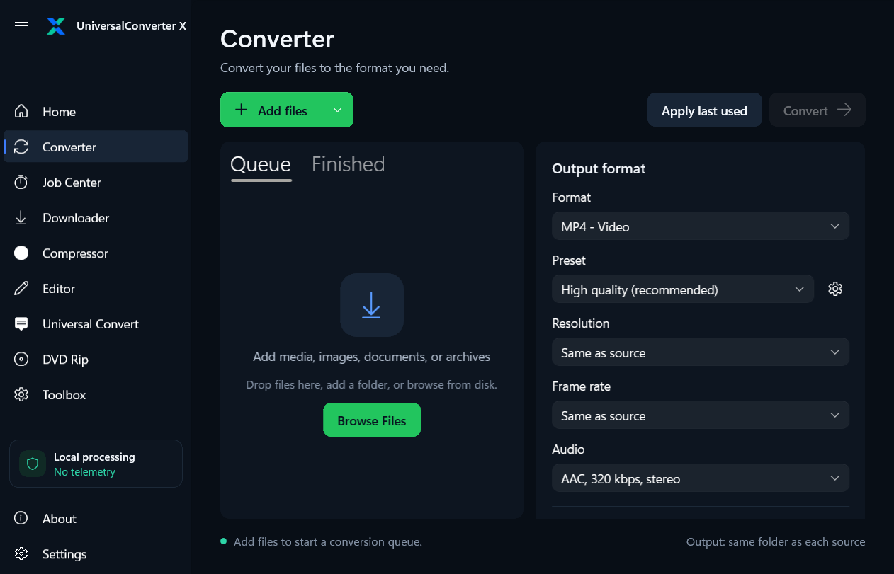
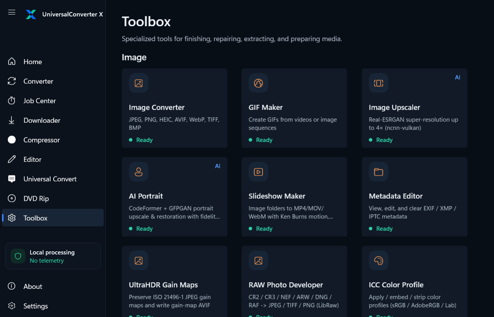
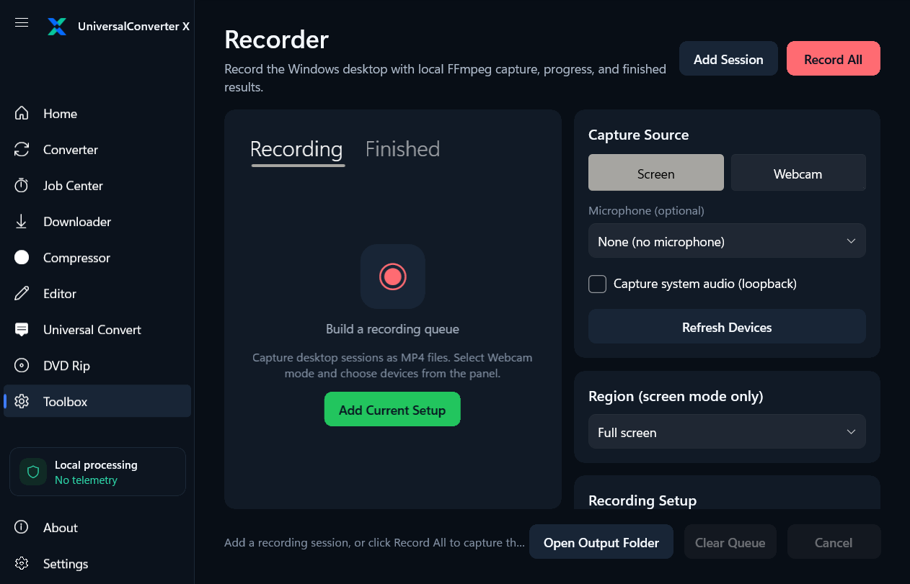
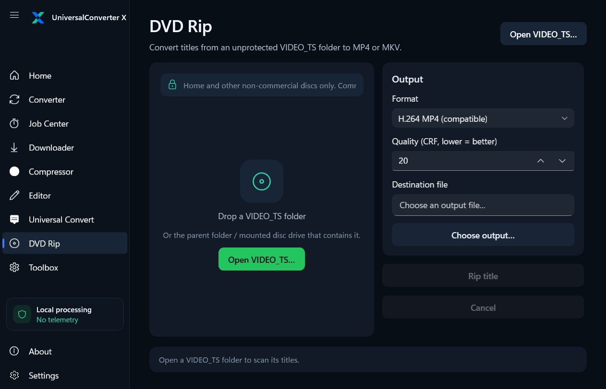

<p align="center">
  
</p>

<h1 align="center">UniversalConverter X</h1>

<p align="center"><strong>Convert, compress, edit, record, and inspect files without uploading them.</strong></p>

<p align="center">
  <a href="https://github.com/SysAdminDoc/UniversalConverterX/releases/latest"></a>
  
  <a href="LICENSE"></a>
  
</p>

<p align="center">
  <a href="https://github.com/SysAdminDoc/UniversalConverterX/releases/latest"><strong>Download the latest release</strong></a>
  &nbsp;·&nbsp;
  <a href="#quick-start">Quick start</a>
  &nbsp;·&nbsp;
  <a href="#command-line-and-automation">Automation</a>
</p>



Most converters make you choose between a web upload, a pile of single-purpose apps, or a subscription. UniversalConverter X keeps the work on your Windows PC and puts the useful paths in one workspace. There is no account, no telemetry, and no recurring fee.

The app currently ships with 465 reviewed presets, 13 native converter backends, and a catalog of 212 sidecar engine adapters. Optional tools report their real readiness before a job starts, so a missing runtime is visible instead of becoming a vague conversion failure.

## See the workspace

<table>
  <tr>
    <td width="50%"></td>
    <td width="50%"></td>
  </tr>
  <tr>
    <td align="center"><strong>One queue for everyday conversions</strong></td>
    <td align="center"><strong>Specialist tools with readiness shown up front</strong></td>
  </tr>
  <tr>
    <td width="50%"></td>
    <td width="50%"></td>
  </tr>
  <tr>
    <td align="center"><strong>Screen, webcam, microphone, and system audio</strong></td>
    <td align="center"><strong>Unprotected DVD titles to MP4 or MKV</strong></td>
  </tr>
</table>

## What it does

| Workflow | What you get |
| --- | --- |
| Convert | Batch video, audio, image, document, eBook, archive, subtitle, disc, and 3D jobs from one queue |
| Compress | Web and archive profiles, target-size encoding, representative previews, and VMAF-guided quality targets |
| Edit | Trim, crop, rotate, rewrap, adjust audio, and process batches without leaving the app |
| Record | Capture the screen or webcam with optional microphone and system audio |
| Enhance | Local upscaling, restoration, denoising, interpolation, background removal, speech, and tagging workflows |
| Automate | Use the same engine catalog from the desktop app, CLI, loopback REST API, or PowerShell |

Useful specialist paths include UltraHDR gain maps, C2PA inspection, IAMF audio, OCR, subtitle work, metadata editing, archive tools, DVD authoring, scene detection, watch folders, and format inspection.

## Why it is different

### Your files stay on your machine

Conversions run locally. UCX does not send telemetry and does not require a cloud account. Network access is reserved for actions you start, such as downloading media or fetching an optional runtime after its license and checksum are shown.

### One catalog, honest status

The desktop app, CLI, REST API, and PowerShell module resolve the same engines and presets. Each sidecar declares its host range, architecture, required tools, and model packs. Incompatible or incomplete engines are quarantined with a reason you can act on.

### Built for long jobs

Queues survive navigation and restart. Converter and Compressor jobs expose preflight warnings, cancellation, retry, and history. Each sidecar runs with process and memory limits, a private temporary directory, and output-path checks.

### Useful without a subscription

The project is free and open source under the MIT license. Core conversion works with the included FFmpeg build. Add only the specialist tools you need.

## Quick start

### Option 1: Portable release

1. Open the [latest release](https://github.com/SysAdminDoc/UniversalConverterX/releases/latest).
2. Download the Windows x64 portable ZIP.
3. Extract it, then run `UniversalConverterX.exe`.
4. Drop in a file or choose a workflow from the Toolbox.

The portable archive does not need an installer. Published artifacts are unsigned unless a release explicitly says otherwise, so Windows may show its standard reputation warning on first launch.

### Option 2: WinGet

```powershell
winget install SysAdminDoc.UniversalConverterX
```

### Requirements

- Windows 10 21H2, build 19044, or newer
- Windows 11 is fully supported
- Optional converter tools for specialist formats
- A compatible .NET 10.0.11 runtime for the framework-dependent shell and proxy hosts in installed packages

The installer includes a pinned FFmpeg 8.1.2 build. Optional runtimes are installed from **Settings > Converter Tools** or with `ucx tools download <tool>`. Downloads supported by UCX use pinned HTTPS sources, exact sizes, and SHA-256 verification.

## Supported platform and release matrix

The supported desktop floor is Windows 10 21H2 (build 19044). Source builds use the .NET 10 SDK and Windows App SDK 2.3.1. Portable, MSIX, and ARM64 app hosts are self-contained.

| Surface | Architecture | Runtime and install behavior |
| --- | --- | --- |
| Portable ZIP / WinGet | Windows x64 | Self-contained desktop and CLI apps; the portable archive is unsigned |
| MSIX | Windows x64 | Self-contained WinUI package; published unsigned for managed signing and sideload policy |
| MSI | Windows x64 | Self-contained app payload; shell and proxy hosts require the .NET 10.0.11 runtime |
| ARM64 publish | Windows ARM64 | Self-contained app hosts; the current sidecar catalog remains x64 unless a manifest says otherwise |

Every extension is checked against the host version, architecture, manifest schema, and required tools before launch. An incompatible extension stays quarantined and may require a rebuild or reinstall.

## Formats and converter backends

UCX chooses a backend from the source and destination formats. You can override that choice when a workflow needs a particular tool.

| Backend | Typical coverage | Priority |
| --- | --- | ---: |
| FFmpeg | Video and audio, 472+ inputs and 199+ outputs | 100 |
| resvg | SVG rendering | 97 |
| libheif | HEIC and HEIF | 96 |
| Inkscape | Vector graphics | 95 |
| libjxl | JPEG XL | 94 |
| libvips | High-performance image conversion | 92 |
| ImageMagick | General image conversion, 245+ inputs and 183+ outputs | 90 |
| Potrace | Raster to vector | 88 |
| Calibre | eBooks | 85 |
| Assimp | 3D models | 85 |
| Pandoc | Documents and markup | 80 |
| Ghostscript | PDF and PostScript | 75 |
| LibreOffice | Office documents | 70 |

Coverage depends on the installed backend and build options. Run `ucx tools check` to see what is ready on your machine.

## Command line and automation

The release includes `ucx.exe` for scripts and unattended batches.

```powershell
# Convert one file
ucx convert video.mp4 -o mp3

# Convert a folder of images
ucx convert *.png -o webp -q high

# Save a machine-readable batch report
ucx convert *.mov -o mp4 --report batch-report.json

# Find a preset by intent without a cloud model
ucx convert-preset --list --search "make movie smaller"

# Inspect engine readiness
ucx engines --json

# Check installed converter tools
ucx tools check
```

Common commands:

| Command | Purpose |
| --- | --- |
| `convert` | Convert one or more files |
| `list` | List formats, converters, or categories |
| `info` | Inspect a local file |
| `config` | Read or change configuration |
| `tools` | Check and manage converter tools |
| `engines` | Show native and sidecar readiness |
| `invoke-engine` | Run an installed sidecar with a JSON argument array |
| `convert-preset` | Run a named desktop-compatible preset |
| `community-presets` | Review and install catalog presets by checksum |
| `serve` | Start the loopback REST job API |

Start the local REST service with a fresh bearer token:

```powershell
ucx serve --port 17654
```

The server binds to loopback only. Browser-origin requests are rejected, write requests require JSON, and every route except `/healthz` requires the startup token. Prometheus metrics are available at `/metrics`; sample local configuration lives in [`integrations/prometheus/`](integrations/prometheus/README.md).

The PowerShell module in [`integrations/powershell/`](integrations/powershell/README.md) exposes the same catalog through `Get-UcxEngine` and `Invoke-UcxEngine`.

## Optional AI and media runtimes

AI inference does not install packages or models in the background. Supported model packs have a separate download action that shows the upstream license, asks for explicit acceptance, pins an immutable source, and verifies the payload before installation. Engines that require a manually provisioned model fail closed when it is absent.

GPU support varies by workflow. Hardware encoders stay disabled until the configured FFmpeg build and driver expose a compatible encoder. A failed hardware initialization retries that job on the CPU while keeping the requested scale and deinterlace settings.

## Safety and privacy

- Sidecars receive a private job workspace that is removed after the run.
- Reported output paths are checked against the approved destination before a result is accepted.
- Archive readers and writers reject traversal, links, oversized members, and compression bombs.
- Tool downloads use allowlisted sources and recorded SHA-256 digests.
- Community presets show their engine, arguments, license, and checksum before installation.
- The REST surface is local-only and token protected.

UCX does not include DRM removal. Protected Kindle and KFX inputs are refused. DVD tools are intended for unprotected, personally authorized media.

## Building from source

### Prerequisites

- .NET 10 SDK
- Python 3.12 for sidecar and release gates
- Windows 10 21H2 or Windows 11

Build, test, and publish with the repository entry point:

```powershell
.\build.ps1 -Target Build -Configuration Release
.\build.ps1 -Target Test -Configuration Release
.\build.ps1 -Target Publish -Configuration Release
```

`-Target Test` runs the complete 20-gate release contract. It covers locked NuGet restore, the .NET suite, Python and sidecar checks, localization, UI accessibility contracts, all registered WinUI routes in light and dark themes plus narrow reflow, dependency audits, artifact integrity, and SBOM reconciliation. The summary is written to `artifacts/gates/gate-summary.json`.

The solution can also be built directly:

```powershell
dotnet build src/UniversalConverterX.sln -c Release -p:Platform=x64
```

NuGet lock files are committed for every project. Dependency changes require an intentional restore and reviewed lock-file update.

## Project layout

```text
src/UniversalConverterX.Core/            Conversion engine and services
src/UniversalConverterX.Console/         ucx command-line app
src/UniversalConverterX.UI/              WinUI 3 desktop app
src/UniversalConverterX.ShellExtension/  Explorer integration
presets/                                 Reviewed conversion recipes
tools/                                   Sidecar engines and manifests
installer/                               Portable, MSI, and MSIX packaging
tests/                                   Unit, contract, security, and UI gates
```

Each sidecar lives under `tools/<name>/` and follows the NDJSON contract in [`tools/README.md`](tools/README.md). Its `ucx.sidecar.json` file records compatibility and runtime requirements before the host will launch it.

## Project notes

- [Changelog](CHANGELOG.md)
- [Roadmap](ROADMAP.md)
- [Research and audit notes](RESEARCH.md)
- [Issue tracker](https://github.com/SysAdminDoc/UniversalConverterX/issues)

## License

UniversalConverter X is released under the [MIT License](LICENSE). Bundled and optional third-party tools keep their own licenses and notices.
